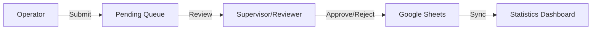

## Overview

The Cashouts system is a comprehensive workflow management tool for registering, reviewing, and tracking cashout operations across multiple gaming companies. It features real-time queue management, statistics tracking, and Google Sheets synchronization.

**Access:** [/cashouts/](/cashouts/) (requires authentication)

## System Architecture



## Main Features

<CardGroup cols={2}>
  <Card title="Submit Cashouts" icon="paper-plane">
    Operators can submit cashout requests with operation codes and optional observations
  </Card>
  <Card title="Review Queue" icon="clipboard-check">
    Supervisors review pending cashouts with real-time timer tracking
  </Card>
  <Card title="Statistics" icon="chart-line">
    Comprehensive analytics by operator, company, shift, and time period
  </Card>
  <Card title="Leaderboard" icon="trophy">
    Real-time rankings of operator performance
  </Card>
  <Card title="Company Rules" icon="book">
    Searchable database of cashout procedures per company
  </Card>
  <Card title="Team Management" icon="users">
    Supervisors can create and manage user accounts
  </Card>
</CardGroup>

## Navigation Sidebar

The sidebar provides access to all system features (cashouts/index.html:22-66):

```html
<aside class="sidebar">
  <button class="role-btn operator active">Submit a Cashout</button>
  <button class="role-btn supervisor">🔍 Review a Cashout</button>
  <button class="role-btn rules">📜 Cashout Rules</button>
  <button class="role-btn leaderboard">🏆 Leaderboard</button>
  <button class="role-btn stats">📊 Stats</button>
  <button class="role-btn" id="manageTeamBtn" style="display: none;">👥 Manage Team</button>
</aside>
```

<Note>
  The "Manage Team" button is only visible to users with the **supervisor** role (cashouts/index.html:611-615)
</Note>

## Submit a Cashout

### Form Fields

<Steps>
  <Step title="Operation Code">
    Unique identifier for the cashout transaction
    ```html
    <input type="text" id="operationCode" name="operationCode" required>
    ```
  </Step>

  <Step title="Operator Name">
    **Auto-filled and read-only** - populated from authenticated user
    ```javascript
    operatorNameInput.value = currentUser.fullName;
    operatorNameInput.readOnly = true; // Prevents impersonation
    ```
  </Step>

  <Step title="Company">
    Dropdown populated from company database
    ```html
    <select id="company" name="company" required>
      <option value="">Seleccione una compañía</option>
    </select>
    ```
  </Step>

  <Step title="Observation (Optional)">
    Modal prompt after form submission
    ```html
    <div id="observacionModal" class="modal-overlay">
      <h3>¿Tienes alguna observación sobre este cashout?</h3>
      <div class="modal-buttons">
        <button id="btnObservacionSi" class="btn-si">SÍ</button>
        <button id="btnObservacionNo" class="btn-no">NO</button>
      </div>
    </div>
    ```
  </Step>
</Steps>

### Submission Flow

```javascript
// 1. Form submission captures data
cashoutPendiente = {
  operationCode: document.getElementById('operationCode').value,
  operatorName: currentUser.fullName, // From JWT
  company: document.getElementById('company').value,
  observacion: ""
};

// 2. Optional observation modal
document.getElementById('observacionModal').style.display = 'flex';

// 3. Submit to API
await apiFetch(`/cashouts`, {
  method: "POST",
  body: JSON.stringify(cashoutPendiente)
});

// 4. Success notification
document.getElementById('operatorSuccess').style.display = 'block';
showNotification("¡Cash out enviado correctamente!", "success");
```

## Review Queue

### Real-Time Queue Management

The review queue auto-refreshes every 10 seconds when active (cashouts/index.html:780-792):

```javascript
function iniciarAutoRefresh() {
  if (autoRefreshInterval) return;
  autoRefreshInterval = setInterval(() => {
    if (reviewSection.style.display === 'block') cargarCola();
  }, 10000); // Refresh every 10 seconds
}
```

### Queue Item Display

Each pending cashout shows:

<Tabs>
  <Tab title="Information">
    - **Operation Code** (bold, prominent)
    - **Company Name**
    - **Operator Name**
    - **Start Time** (cashoutChecking timestamp)
    - **Live Timer** (⏱️ elapsed time)
    - **Observation Tag** (if present)
  </Tab>

  <Tab title="Timer Calculation">
    ```javascript
    function calcularTiempoTranscurrido(cashoutChecking) {
      const [fecha, hora] = cashoutChecking.split(' ');
      const [mes, dia, año] = fecha.split('/');
      const [horas, mins, segs] = hora.split(':');
      const inicio = new Date(año, mes - 1, dia, horas, mins, segs);
      const diffSeg = Math.floor((new Date() - inicio) / 1000);
      
      const h = Math.floor(diffSeg / 3600);
      const m = Math.floor((diffSeg % 3600) / 60);
      const s = diffSeg % 60;
      
      return `${h}h ${m}m ${s}s`;
    }
    ```
  </Tab>

  <Tab title="Actions">
    Two action buttons per item:
    
    **Approve Button:**
    ```html
    <button onclick="iniciarRevision('${row}', 'paid')" class="btn-action btn-verify">
      <svg><!-- Checkmark icon --></svg>
      <span>Aprobar</span>
    </button>
    ```
    
    **Reject Button:**
    ```html
    <button onclick="iniciarRevision('${row}', 'rejected')" class="btn-action btn-reject">
      <svg><!-- X icon --></svg>
      <span>Rechazar</span>
    </button>
    ```
  </Tab>
</Tabs>

### Review Process

<Steps>
  <Step title="Select Action">
    Reviewer clicks Approve or Reject button
  </Step>

  <Step title="Reviewer Identification">
    Modal prompts for reviewer name (first time):
    ```html
    <select id="revisionTurnoSelect">
      <option value="">Seleccione un revisor</option>
      <option value="Melanie Barrientos">Melanie Barrientos</option>
      <option value="Cristopher Cardozo">Cristopher Cardozo</option>
      <!-- ...more reviewers... -->
    </select>
    ```
  </Step>

  <Step title="Observation Review">
    If operator left an observation, reviewer can add comments:
    ```html
    <div id="observacionOriginalDisplay">
      <strong>Observación Operador:</strong><br>${observacionOriginal}
    </div>
    <textarea id="supervisorObsTexto" placeholder="Escribe tu complemento aquí..."></textarea>
    ```
  </Step>

  <Step title="Submit Decision">
    Action is processed via API and reflected in statistics
  </Step>
</Steps>

## Cashout Rules

Searchable database of company-specific cashout procedures (cashouts/index.html:171-193):

### Features

<CardGroup cols={2}>
  <Card title="Search" icon="magnifying-glass">
    ```html
    <input type="text" id="searchRules" 
           placeholder="🔍 Buscar compañía por nombre..." 
           style="width: 100%;">
    ```
  </Card>

  <Card title="Add Company" icon="plus">
    Supervisors can add new companies (hidden by default):
    ```html
    <div id="newCompanyContainer" style="display: none;">
      <input type="text" id="newCompanyName" 
             placeholder="Nombre de la nueva compañía">
      <button id="btnCreateCompany">Guardar</button>
    </div>
    ```
  </Card>

  <Card title="Grid Layout" icon="grid">
    Rules displayed in responsive grid:
    ```html
    <div id="rulesGrid" class="rules-grid"></div>
    ```
  </Card>

  <Card title="Database Sync" icon="database">
    Rules loaded from backend on demand:
    ```javascript
    <div id="rulesLoading" style="text-align: center;">
      ⏳ Cargando reglas desde la base de datos...
    </div>
    ```
  </Card>
</CardGroup>

## Statistics Dashboard

Comprehensive analytics modal (cashouts/index.html:196-432):

### Filters

```html
<div class="stats-filters">
  <input type="date" id="statsStartDate" />
  <input type="date" id="statsEndDate" />
  <select id="statsCompanyFilter">
    <option value="">Todas las compañías</option>
  </select>
  <button id="applyStatsFilters">Aplicar Filtros</button>
</div>
```

### Metrics Overview

<CardGroup cols={2}>
  <Card title="Approved Cashouts" icon="check">
    Green card with total approved count
    ```html
    <div id="totalApproved" style="color: #27ae60;">-</div>
    ```
  </Card>

  <Card title="Rejected Cashouts" icon="times">
    Red card with total rejected count
    ```html
    <div id="totalRejected" style="color: #e74c3c;">-</div>
    ```
  </Card>

  <Card title="Approval Rate" icon="percent">
    Blue card with percentage
    ```html
    <div id="approvalRate" style="color: #3498db;">-</div>
    ```
  </Card>

  <Card title="Total Processed" icon="list">
    Orange card with total count
    ```html
    <div id="totalProcessed" style="color: #f39c12;">-</div>
    ```
  </Card>
</CardGroup>

### Detailed Reports

<Tabs>
  <Tab title="Operator Ranking">
    Table ranking by operator performance:
    
    | # | Operator | Approved | Rejected | Total | Rate |
    |---|----------|----------|----------|-------|------|
    | 1 | John Doe | 245 | 12 | 257 | 95.3% |
    
    ```html
    <table id="rankingTable">
      <thead>
        <tr>
          <th>#</th>
          <th>Operador</th>
          <th>Aprobados</th>
          <th>Rechazados</th>
          <th>Total</th>
          <th>Tasa</th>
        </tr>
      </thead>
      <tbody id="rankingTableBody"></tbody>
    </table>
    ```
  </Tab>

  <Tab title="Shift Averages">
    Average performance by shift:
    
    - **🌅 Mañana (7:00-14:30)**
    - **🌇 Tarde (14:30-22:00)**
    - **🌙 Noche (22:00-7:00)**
    
    ```html
    <tbody id="shiftTableBody">
      <tr>
        <td>Mañana</td>
        <td>Total Cashouts</td>
        <td>Promedio/día</td>
        <td>% del Total</td>
      </tr>
    </tbody>
    ```
  </Tab>

  <Tab title="Operator by Shift">
    Individual operator performance per shift:
    
    ```html
    <table>
      <thead>
        <tr>
          <th>Operador</th>
          <th>🌅 Mañana</th>
          <th>🌇 Tarde</th>
          <th>🌙 Noche</th>
          <th>Mejor Turno</th>
        </tr>
      </thead>
      <tbody id="operatorShiftTableBody"></tbody>
    </table>
    ```
  </Tab>

  <Tab title="Company Breakdown">
    Cashouts grouped by company:
    
    ```html
    <tbody id="companyTableBody">
      <tr>
        <td>Company Name</td>
        <td>Approved</td>
        <td>Rejected</td>
        <td>Total</td>
        <td>Rate</td>
      </tr>
    </tbody>
    ```
  </Tab>

  <Tab title="Complete History">
    Paginated full transaction history:
    
    ```html
    <input type="text" id="searchHistory" 
           placeholder="🔍 Buscar por código de operación...">
    <select id="operatorFilter">
      <option value="">Todos los operadores</option>
    </select>
    
    <div id="pagination">
      <span id="paginationInfo">Mostrando 0-0 de 0</span>
      <button id="prevPage">◄ Anterior</button>
      <span id="pageNumbers"></span>
      <button id="nextPage">Siguiente ►</button>
    </div>
    ```
  </Tab>
</Tabs>

## Leaderboard

Real-time operator rankings modal (cashouts/index.html:530-541):

```html
<div id="leaderboardModal" class="modal-overlay">
  <div class="modal-content leaderboard-modal">
    <div class="leaderboard-header">
      <h2 class="leaderboard-title">🏆 LEADERBOARD</h2>
      <button id="cerrarLeaderboard" class="btn-close-leaderboard">✕</button>
    </div>
    <div id="leaderboardContent" class="leaderboard-body">
      <p>Cargando estadísticas...</p>
    </div>
  </div>
</div>
```

## Team Management

**Available to:** Supervisors only

### Create New Users

```html
<div style="background: rgba(42, 157, 143, 0.05);">
  <h3>+ Crear Nuevo Usuario</h3>
  <input type="text" id="newFullName" placeholder="Nombre Completo">
  <input type="text" id="newUsername" placeholder="Usuario de acceso">
  <input type="password" id="newPassword" placeholder="Contraseña">
  <select id="newRole">
    <option value="analista">Analista</option>
    <option value="supervisor">Supervisor</option>
    <option value="chats">Chats</option>
  </select>
  <button id="btnCreateUser">Crear Cuenta</button>
</div>
```

### User List Table

```html
<table>
  <thead>
    <tr>
      <th>Nombre</th>
      <th>Usuario</th>
      <th>Rol</th>
      <th>Acción</th>
    </tr>
  </thead>
  <tbody id="usersTableBody">
    <!-- Dynamically populated -->
  </tbody>
</table>
```

## API Endpoints

| Endpoint | Method | Purpose | Auth Required |
|----------|--------|---------|---------------|
| `/api/cashouts` | POST | Submit new cashout | ✅ |
| `/api/cashouts?status=pending&limit=300` | GET | Fetch pending queue | ✅ |
| `/api/cashouts` | GET | Fetch all cashouts (filtered) | ✅ |

**Base URL:** `https://general-cashouts.onrender.com/api`

## Queue Rendering Logic

### Smart Update Strategy

To prevent UI flicker, the queue only re-renders when actual changes occur:

```javascript
function renderizarCola(items) {
  // Sort by newest first
  items.sort((a, b) => 
    new Date(b.cashoutChecking || b.timestamp) - 
    new Date(a.cashoutChecking || a.timestamp)
  );

  const idsActuales = items.map(i => i.row).sort().join(',');
  const idsEnUI = Array.from(verificationQueue.querySelectorAll('[data-cashout-id]'))
    .map(el => el.getAttribute('data-cashout-id'))
    .sort().join(',');

  // Only update timers if no structural changes
  if (idsActuales === idsEnUI && items.length > 0) {
    items.forEach(item => {
      const div = verificationQueue.querySelector(`[data-cashout-id="${item.row}"]`);
      if (div && item.cashoutChecking) {
        const cro = div.querySelector('.cronometro-live');
        if (cro) cro.textContent = `⏱️ ${calcularTiempoTranscurrido(item.cashoutChecking)}`;
      }
    });
    return; // Skip full re-render
  }

  // Full render if items changed
  // ...
}
```

## Notifications System

```javascript
function showNotification(msg, type = "success") {
  notification.textContent = msg;
  notification.style.background = type === "error" 
    ? "linear-gradient(135deg, #FF6B9D, #FFA07A)" 
    : "linear-gradient(135deg, #00C9FF, #92FE9D)";
  notification.style.color = type === "error" ? "#fff" : "#003d5c";
  notification.classList.add('show');
  setTimeout(() => notification.classList.remove('show'), 3200);
}
```

**Usage examples:**
- `showNotification("¡Cash out enviado correctamente!", "success")`
- `showNotification("Error al subir cash out.", "error")`

## Best Practices

<AccordionGroup>
  <Accordion title="Always Include Observations for Edge Cases">
    Use the observation field to document unusual circumstances, helping reviewers make informed decisions.
  </Accordion>

  <Accordion title="Review Queue Should Stay Open">
    Keep the review queue tab active to benefit from auto-refresh and real-time updates.
  </Accordion>

  <Accordion title="Use Filters in Statistics">
    Apply date and company filters to generate targeted reports for specific periods or partners.
  </Accordion>

  <Accordion title="Monitor Live Timers">
    Queue items with long elapsed times may indicate stalled reviews that need attention.
  </Accordion>
</AccordionGroup>